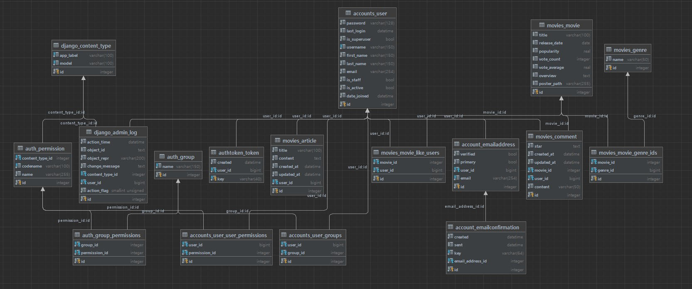
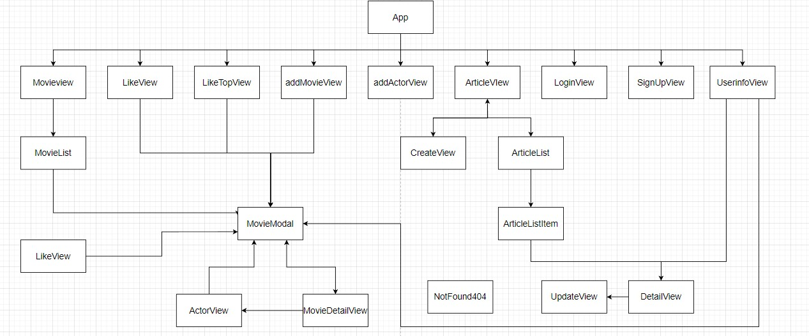
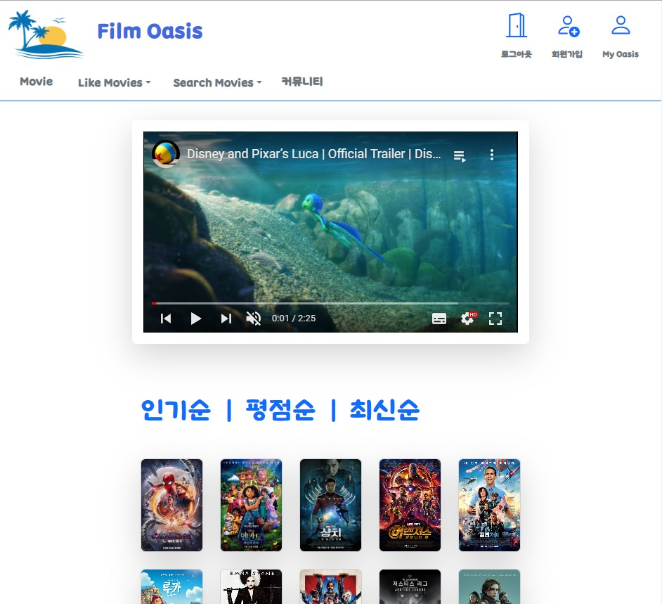
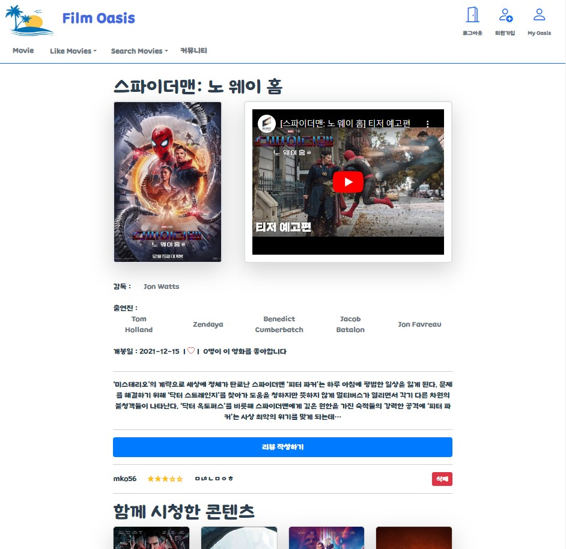
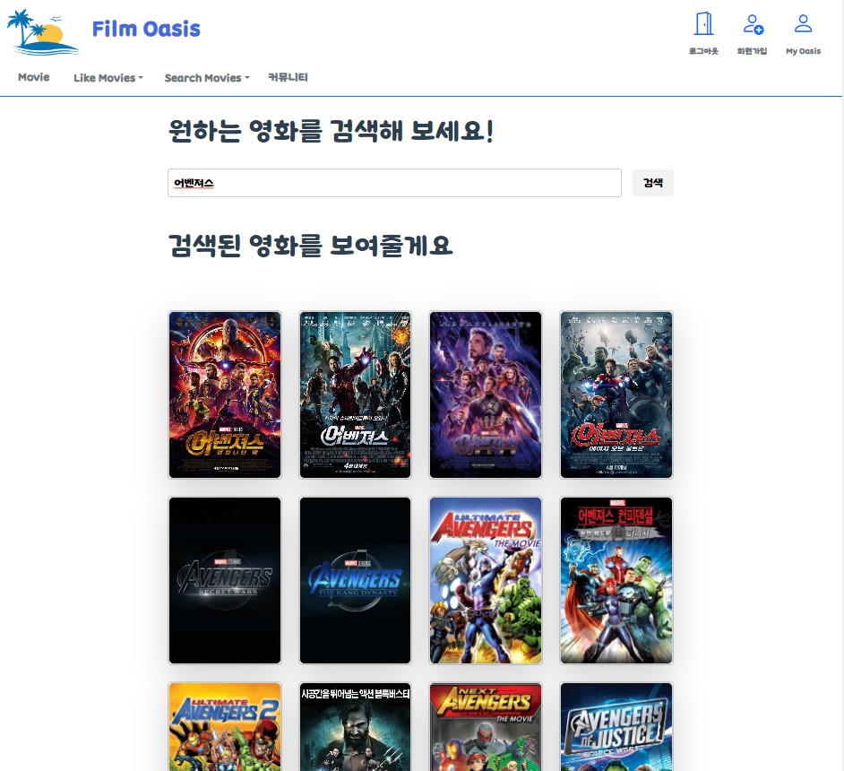
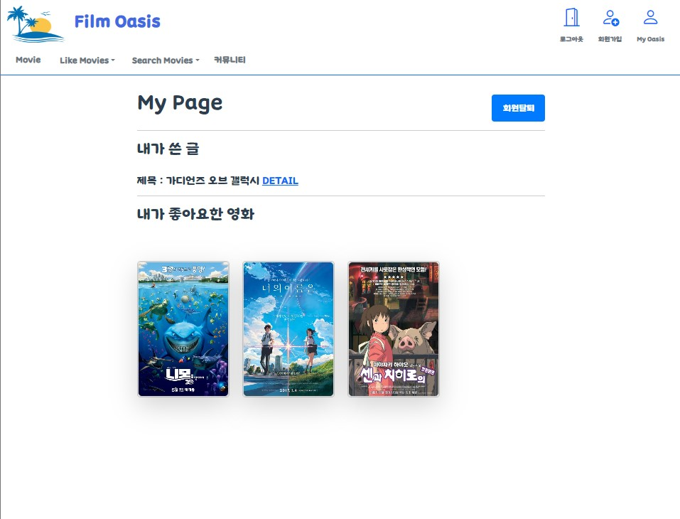

# 영화 추천 및 정보 제공 사이트 

# 팀원 정보 및 업무 분담 내역

- https://www.notion.so/c0edf83b3b2d41d6963174d9eeb18226?pvs=4

# 목표 서비스 구현 및 실제 구현 정도

- 회원가입, 로그인, 로그아웃, 유저정보 페이지

- 커뮤니티 페이지

- 인기순, 최신순, 평점순으로 영화 찾기

- 배우, 감독, 영화 검색 서비스

- 영화 디테일 페이지

- 좋아하는 영화 선택 및 좋아요 한 영화에 관련한 영화 추천 알고리즘

- API를 통한 영화데이터 DB에 추가

# 데이터베이스 모델링(ERD)



```
#장르 모델 
class Genre(models.Model):
    name = models.CharField(max_length=50)

    def __str__(self):
        return self.name

#무비모델
class Movie(models.Model):
    genre_ids = models.ManyToManyField(Genre, related_name='movies')
    like_users = models.ManyToManyField(settings.AUTH_USER_MODEL, related_name='rated_movies')
    id = models.IntegerField(primary_key=True)
    title = models.CharField(max_length=100, null=True)
    release_date = models.DateField(null=True)
    popularity = models.FloatField(null=True)
    vote_count = models.IntegerField(null=True)
    vote_average = models.FloatField(null=True)
    overview = models.TextField(null=True)
    poster_path = models.CharField(max_length=255, null=True)

#영화에 대한 댓글
class Comment(models.Model):
    movie = models.ForeignKey(Movie, on_delete=models.CASCADE)
    user = models.ForeignKey(settings.AUTH_USER_MODEL, on_delete=models.CASCADE)
    content = models.CharField(max_length=50,)
    star = models.TextField()
    created_at = models.DateTimeField(auto_now_add=True)
    updated_at = models.DateTimeField(auto_now=True)

#커뮤니티 아티클
class Article(models.Model):
    user = models.ForeignKey(settings.AUTH_USER_MODEL, on_delete=models.CASCADE)
    title = models.CharField(max_length=100)
    content = models.TextField()
    created_at = models.DateTimeField(auto_now_add=True)
    updated_at = models.DateTimeField(auto_now=True)
```

# 컴포넌트 구조



- 메인 페이지

- 영화 좋아요 선택 및 좋아하는 영화와 관련된 영화를 추천해주는 페이지

- 회원들이 좋아요가 높은 순으로 20개의 영화 추천

- 배우, 감독, 영화 검색 페이지

- 로그인, 회원가입, 유저 페이지

- 커뮤니티 페이지

- 404 NOTFOUND  페이지

# 영화 추천 알고리즘

- **좋아요 선택한 영화를 바탕으로 영화를 추천해주는 알고리즘**
  
  유저가 좋아요한 영화들을 먼저 뽑은 다음 영화의 장르ID를 리스트로 만들어 user_genres에 저장한 다음 필터를 통해 유저가 좋아요한 영화들을 제외한 user_genres안에 포함된 장르들의 영화들을 필터링
  
  그 다음 12개의 영화를 랜덤으로 선택하여 12개보다 적을경우 모두 선택
  
  ```
  user_movies = Movie.objects.filter(like_users__id=user_pk)  
      user_genres = []
  
      for movie in user_movies:
          genre_ids = movie.genre_ids.all().values_list('id', flat=True)  
          user_genres.extend(list(genre_ids))  
  
      recommended_movies = Movie.objects.filter(genre_ids__in=user_genres).exclude(like_users__id=user_pk).distinct()
      recommended_movies = random.sample(list(recommended_movies), min(12, len(recommended_movies)))
  ```

- 평점순
  
  투표수가 1000이상이며 1970년도 이후의 영화들중 평점순이 높은것으로 25개
  
  ```
  rank_movies = Movie.objects.filter(vote_count__gte=1000,release_date__year__gte=1970).order_by('-vote_average')[:25]
  ```

- 최신순
  
  2023년 1월 이후에 개봉한 영화들중 인기순이면서 최신순으로 25개 
  
  ```
  new_movies = Movie.objects.filter(release_date__year__gte=2023, release_date__month__gte=1).order_by('-popularity','-release_date' )[:25]
  ```

- 인기순
  
  투표수가 5000이상이며 2018년 이후의 영화들 중 인기순이면서 최신순으로 25
  
  ```
  popular_movies = Movie.objects.filter(vote_count__gte=5000,release_date__year__gte=2018).order_by('-popularity','-release_date' )[:25]
  ```

- 배우, 감독
  
  API로 받은 데이터 중 배우들 중 5명을 뽑고 감독은 역할이 'Director' 인 사람을 뽑아 영화의 데이터를 가져옴
  
  ```
  this.cast = res.data.cast.slice(0, 5)
  this.director= crews.filter(crew => crew.job === 'Director');
  ```

- 영화 디테일 페이지에서 영화와 관련된 데이터를 API로 뽑아옴

# 서비스 대표 기능

- 메인 페이지에서 인기순, 최신순, 평점순으로 25개의 영화의 데이터를 출력

- 영화의 상세페이지로 이동할 수 있는 모달을 활용하여 영화의 전체적인 페이지에서 영화의 데이터를 불러오는 모든 것들을 모달과 연결하여 디테일 페이지로 이동가능

- navbar를 활용하여 스크롤을 할 때 화면 구성 변화

- 초기에  DB의 적은 데이터가 영화의 검색 및 알고리즘을 통해 영화의 데이터를 점차 증가하도록 구성 

- 유투브 API를 활용하여 메인페이지와 영화 디테일 페이지에서 예고편 출력

# 프로젝트 화면 페이지

- 메인페이지
  
  

- 영화 디테일 페이지
  
  

- 영화 검색페이지
  
  

- 유저 정보 페이지
  
  
